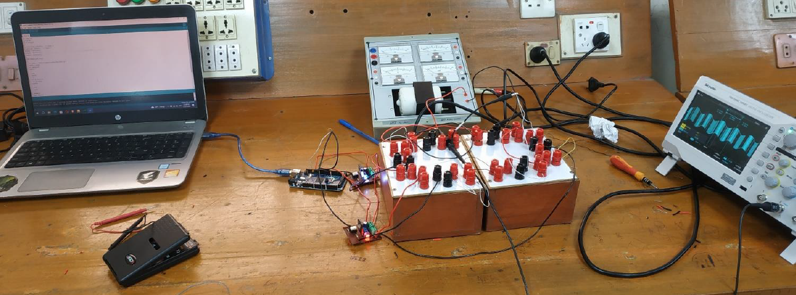
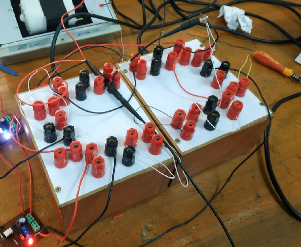
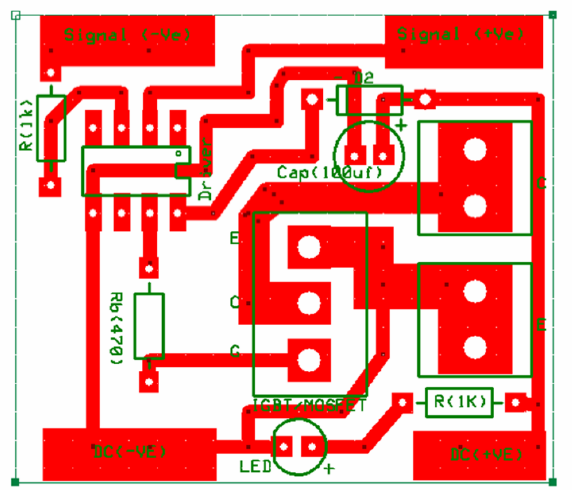
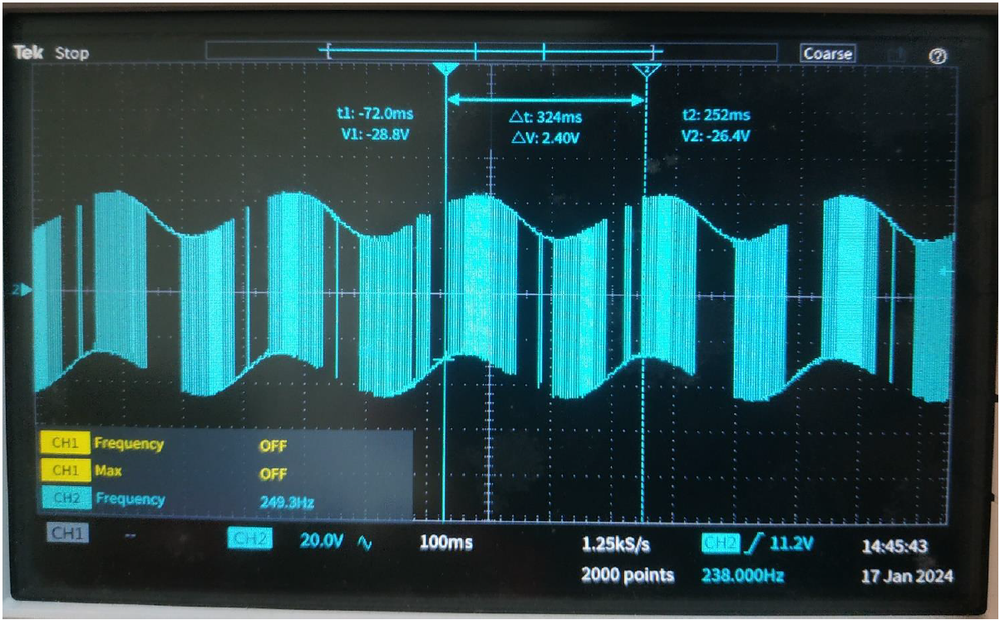

<h1 align="center">
Single Phase H-Bridge Inverter Design and Implementation
</h1>

## Project Overview
The Single Phase H-Bridge Inverter project is a practical implementation focused on converting DC signals into single-phase AC signals for driving induction motors. Utilizing an Arduino microcontroller, this project demonstrates how efficient signal control and MOSFET switching can create an effective inverter circuit.

The design integrates various components such as optocouplers, MOSFETs, and a driver circuit to convert low-voltage control signals to higher voltage levels suitable for load operation. This inverter system finds applications in motor control, power electronics, and embedded systems.

---

## Required Components
- **Driver A3120 Optocoupler (2 pcs)**
- **MOSFET IRF 240N (2 pcs)**
- **Two-pin Connector (2 pcs)**
- **Three-pin Connector (2 pcs)**
- **8-pin IC Holder (2 pcs)**
- **LED (2 pcs)**
- **Diode (2 pcs)**
- **Capacitor (100µF; 2 pcs)**
- **Resistor (1kΩ 4 pcs; 470Ω 2 pcs)**
- **Flexible Wire**
- **Screwdriver**

---

## Experimental Setup

<h1 align="center">
   
</h1>

### Equipment and Setup Overview

1. **PCB Switches**  
   <h1 align="center">
      
   </h1>

2. **Transformer Boxes as Power Sources**  
   <h1 align="center">
      
   </h1>

3. **PCB After Soldering**  
   <h1 align="center">
      
   </h1>

4. **Connection of PCB**  
   <h1 align="center">
      
   </h1>

---

## Arduino Code:
```c
int ang = 0;
int d = 10;

void setup() {
    pinMode(10, OUTPUT); // Timer 2
    pinMode(9, OUTPUT);  // Timer 2
    TCCR2A = B10110001;
    TCCR2B = B00000101;
    TIMSK2 = B00000001;
}

ISR(TIMER2_OVF_vect) {
    int duty = (255 * sin(ang * 3.1416 / 180) + 255) / 2;
    OCR2A = duty;
    if (duty == 0) {
        d = 0;
    } else {
        d = 10;
    }
    int y = duty + d;
    if (y >= 255) {
        y = 255;
    } else {
        y = y;
    }
    OCR2B = y;
    ang = ang + 5;
    if (ang > 360) {
        ang = 0;
    }
}

void loop() {
}
```

---

## Working Procedure
1. **Bipolar AC Signal Generation**  
   The Arduino microcontroller was used to generate the required bipolar AC signal, acting as the control unit for the H-bridge inverter circuit.

2. **Driver Circuit Setup**  
   The driver circuit on the PCBs incorporated an optocoupler to convert low-voltage signals from the Arduino to 18V DC. This external source was used to drive the MOSFET gate signals.

3. **MOSFET Gate Control**  
   The MOSFETs controlled the current flow, with a 36V source connected to the collector and ground connected to the emitter terminal, thereby enabling efficient switching for AC signal conversion.

4. **AC Signal Creation**  
   By combining the two PCB switches, the system generated an alternating current (AC) signal across the load, demonstrating successful signal conversion and control.

---

## Output
- **Signal Across Induction Motor (Running Condition)**  
  <h1 align="center">
     
  </h1>

---

## Reference Values
- **Peak-to-Peak Voltage:** 90V  
- **RMS Voltage:** 31V  
- **Frequency Calculation:**  
   $$f = \frac{1}{T} = \frac{1}{324 \text{ ms}} = 3.086 \text{ Hz}$$


---

## Conclusion
The induction motor, rated for 110V AC, operated at an RMS voltage output of 31V and a frequency of 3.086Hz. This deviation from the rated values required frequency adjustments to maintain functionality. The project successfully demonstrated the principles of AC signal generation and conversion using an H-bridge inverter circuit.
